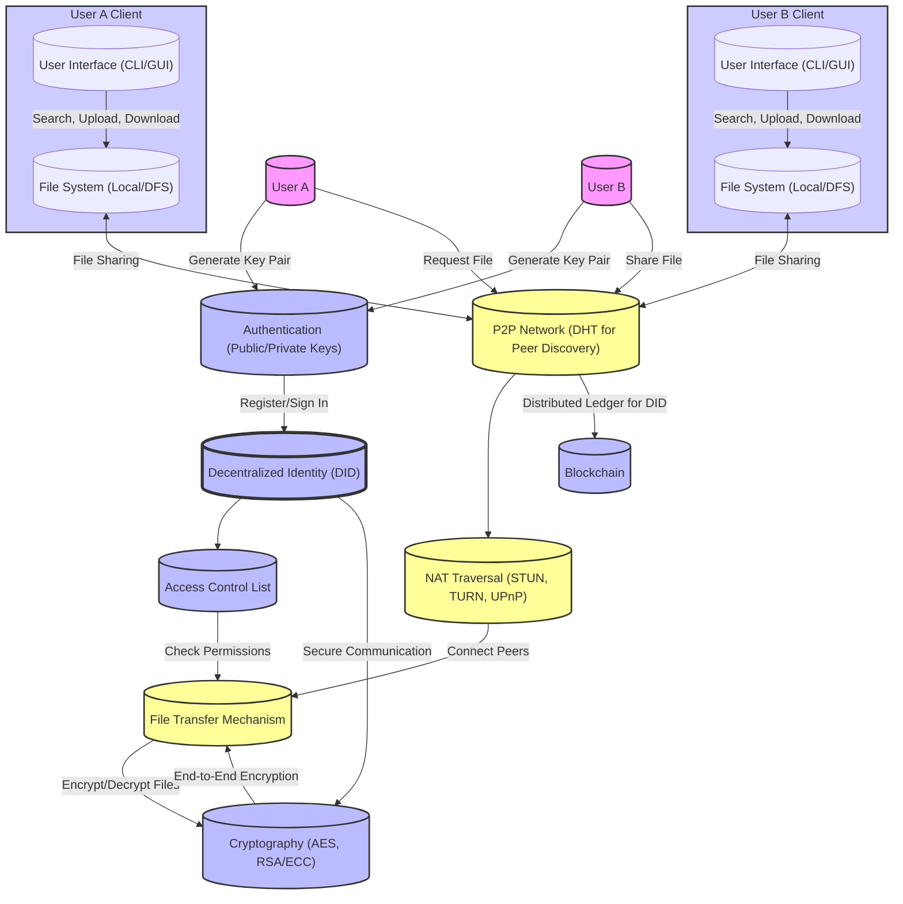

# Project Name: GoVault - Decentralized Secure File Sharing (DSFS)

## Overview
GoVault aims to provide a secure, user-friendly, and decentralized platform for sharing files among authenticated users. Leveraging peer-to-peer technology, the system ensures privacy, security, and accessibility without relying on centralized servers.

## Goals
- Enable secure and efficient file sharing between authenticated users.
- Utilize decentralized technologies for improved privacy and control.
- Ensure the system is scalable, resilient, and easy to use.

## Core Features

### 1. User Authentication and Authorization
   - Utilize public/private key pairs for user identification and authentication.
   - Implement Access Control Lists (ACLs) for fine-grained permission management.

### 2. Decentralized Identity (DID) Integration
   - Allow users to manage identities through blockchain-based DIDs.
   - Secure communication and file access through verifiable credentials.

### 3. NAT Traversal for Peer Connectivity
   - Implement techniques like UPnP, STUN, and TURN to facilitate peer connections across NATs and firewalls.

### 4. File Sharing Mechanics
   - Split files into chunks for efficient, parallel transfers.
   - Encrypt files during transfer and at rest, ensuring that only authorized users can access them.

### 5. Peer Discovery and Management
   - Use Distributed Hash Table (DHT) for decentralized peer discovery and management.
   - Support dynamic peer addition and removal with real-time updates.

### 6. User Interface
   - Develop intuitive CLI and GUI clients for interacting with the GoVault network.
   - Implement search, upload, download, and file management functionalities.

## Technical Specifications

### 1. Programming Languages: 

#### Go (Golang)
- Rationale: Efficient performance, strong support for concurrent operations, and robust standard library for networking and cryptography.
#### HTML/CSS/JavaScript
- Rationale: Cross-platform compatibility, rich user experience (UX), rapid development, ease of deployment, and potential for integration with other web based technologies 

### 2. Cryptography
   - Use RSA or ECC for public/private key operations.
   - AES for file encryption, with keys exchanged securely between peers.

### 3. Networking
   - Leverage libp2p or a similar framework for peer-to-peer networking capabilities.
   - Implement HTTP/2 or gRPC for efficient communication between clients and peers.

### 4. Data Storage
   - Local file system for storing user files and application data.
   - Optional integration with distributed file systems (e.g., IPFS) for enhanced resilience and availability.

### 5. Security Considerations
   - Implement end-to-end encryption for all file transfers.
   - Securely store private keys and sensitive information using encrypted storage.

## Development Phases

### Phase 1: Prototype Development
   - Basic peer-to-peer connectivity and file transfer capabilities.
   - Command-line interface (CLI) for file operations.

See the following links for more information about phase 1
- [Phase 1](https://github.com/JoshKoiro/GoVault/blob/doc/Specifications/developmentPhases/Phase1.md)
- [Phase 1 Testing](https://github.com/JoshKoiro/GoVault/blob/doc/Specifications/developmentPhases/Phase1Testing.md)

### Phase 2: Security and Identity
   - Integration of authentication, authorization, and encryption mechanisms.
   - Development of the decentralized identity system.

see below for more information about phase 2 development
   [Phase 2](https://github.com/JoshKoiro/GoVault/blob/doc/Specifications/developmentPhases/Phase2.md)

### Phase 3: User Interface and Experience
   - Development of graphical user interface (GUI) for easier interaction.
   - Enhancement of user experience with additional features like search and file previews.

see below for more information about phase 2 development
   [Phase 3](https://github.com/JoshKoiro/GoVault/blob/doc/Specifications/developmentPhases/Phase3.md)

### Phase 4: Testing and Optimization
   - Comprehensive testing across different network conditions and platforms.
   - Performance optimization and scalability enhancements.

See below for more information about phase 4:
[Phase 4](https://github.com/JoshKoiro/GoVault/blob/doc/Specifications/developmentPhases/Phase4.md)

## Collaboration Tools

- **Version Control**: [Github](https://www.github.com) for source code management and collaboration using the [Gitflow](https://github.com/JoshKoiro/GoVault/blob/doc/Specifications/gitflow.md) methodology.

## Licencing

This project is licenced under the MIT License

## System Design Diagram

## GoVault System Architecture

The GoVault architecture outlines the interaction between various components designed to facilitate secure, decentralized file sharing. Below is an overview of how these components interact:

### User Interaction and Authentication

- **Users (User A and User B)** begin by generating a **key pair** (public/private keys) as part of the **Authentication** process, establishing the foundation for secure identity and communication.
- Following key generation, users proceed to register or sign in using the **Decentralized Identity (DID)** system, leveraging blockchain technology to manage identities securely and without centralized control.
- The **Access Control List (ACL)** works in conjunction with user authentication to manage permissions, dictating which users have access to specific files or resources within the network.

### Peer-to-Peer Networking and File Sharing

- Users engage with the **P2P Network** for the purpose of file sharing. This network employs a **Distributed Hash Table (DHT)** for decentralized peer discovery, enabling users to find and connect without relying on a central server.
- **NAT Traversal** methods (STUN, TURN, UPnP) ensure peers can establish connections across NATs and firewalls, allowing for direct file transfers within the P2P network.

### File Transfer Process

- The **File Transfer Mechanism** oversees the sharing of files, handling the division of files into chunks for efficient transfer and managing file encryption/decryption to ensure security.
- Encryption of files during transfer and at rest is managed by the **Cryptography** component, utilizing algorithms such as AES for encryption and RSA/ECC for key exchange.

### Security and Encryption

- The **Cryptography** component is crucial for securing communication and file access within the system, ensuring all file transfers are end-to-end encrypted and managing the secure storage of private keys and sensitive information.
- Enhanced secure communication is supported by the DID system, which incorporates blockchain technology to provide a tamper-proof ledger for identity verification and management.

### Client Applications

- **Client applications (User A Client and User B Client)** offer the interface for users to interact with the GoVault network, featuring both command-line interfaces (CLI) and graphical user interfaces (GUI) for tasks such as file searching, uploading, and downloading.
- The **File System** component within each client is responsible for the local storage of files and interfaces with the P2P network for file sharing, possibly integrating with distributed file systems (DFS) like IPFS for added resilience and availability.

### Blockchain Integration

- The **Blockchain** component supports the DID system by offering a distributed ledger for the secure management of decentralized identities, ensuring user identities are verifiable and resistant to tampering.

This architecture presents a decentralized system where users can share files securely through a peer-to-peer network, emphasizing authentication, authorization, and encryption to safeguard user data and ensure privacy. The design aims to be scalable, resilient, and user-friendly, incorporating modern cryptographic techniques and decentralized technologies to deliver a secure file-sharing service.
