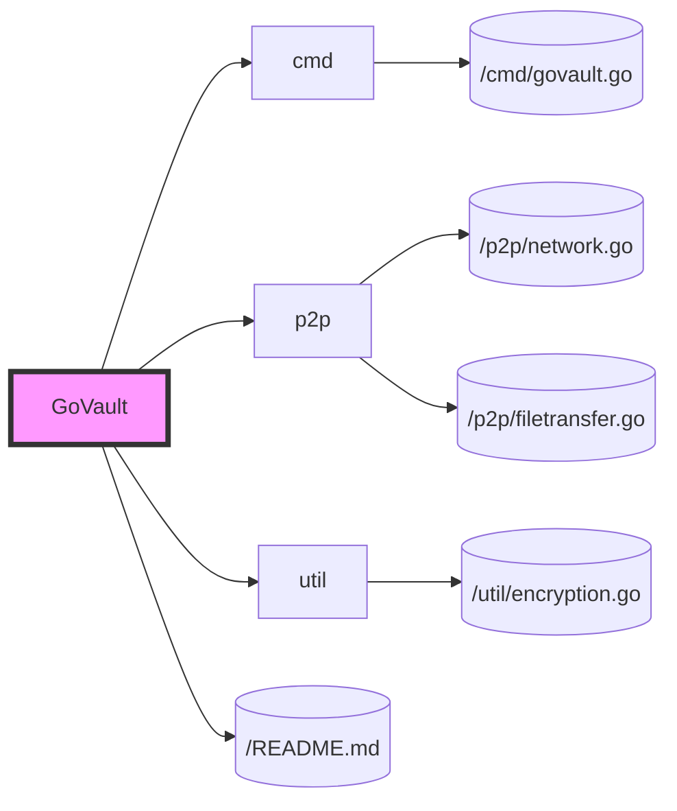

# Phase 1: Prototype Development

## Objective
Establish the foundational components of GoVault, enabling basic peer-to-peer (P2P) file sharing functionalities and a command-line interface for user interactions.

## Key Features
- Basic P2P connectivity for file sharing.
- Command-line interface for file operations (search, upload, download).

## Development Tasks

### 1. P2P Connectivity
- Implement a basic P2P networking layer using libp2p or a similar framework.
- Enable peer discovery and management using a Distributed Hash Table (DHT).

### 2. File Transfer Mechanism
- Develop functionalities for splitting files into chunks and transferring them between peers.
- Implement basic file encryption for secure transfers (to be enhanced in later phases).

### 3. Command-Line Interface (CLI)
- Create a CLI tool for user interactions, allowing users to share and download files.
- Include commands for starting the application, sharing a file, searching for files, and downloading files.

### 4. Testing and Documentation
- See [Phase1 Testing](/developmentPhases/Phase1Testing.md)
- Document the setup and usage instructions for the CLI tool.

## Phase 1 File Structure

## Expected Outcomes
- A functional GoVault prototype with basic P2P file sharing capabilities.
- A CLI for users to interact with GoVault, share, and download files.