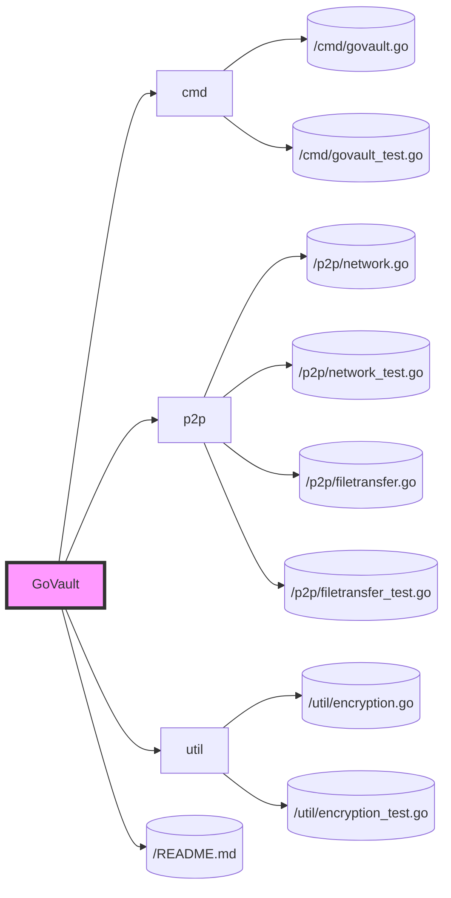

# Testing Strategy for Phase 1: Prototype Development

## Objective
Ensure the reliability, performance, and correctness of GoVault's foundational features through comprehensive testing.

## Key Testing Areas
- **P2P Connectivity**: Verify the ability to discover peers and establish connections.
- **File Transfer Mechanism**: Ensure files are correctly split, encrypted, transferred, and reassembled.
- **Command-Line Interface (CLI)**: Test the usability and functionality of CLI commands.

## Testing Tasks

### 1. Unit Tests
- Develop unit tests for individual components (networking, file transfer logic, encryption utilities).
- Use Go's built-in testing framework (`testing` package) for creating and running tests.

### 2. Integration Tests
- Create tests that simulate real-world scenarios of file sharing between peers.
- Test the integration between the CLI and the P2P networking layer.

### 3. Performance Tests
- (Optional for Phase 1) Benchmark the system's performance, focusing on file transfer speeds and peer discovery efficiency.

## File Structure with Tests

## Test Execution
- Run tests using the Go command line tool with `go test ./...` to execute all tests in the project directory.
- Integrate continuous integration (CI) tools like GitHub Actions to automatically run tests on commits and pull requests.

## Expected Outcomes
- A well-tested GoVault prototype that demonstrates reliability and correctness in its core functionalities.
- A foundation for a culture of testing within the development team, ensuring future features are developed with quality and stability in mind.
