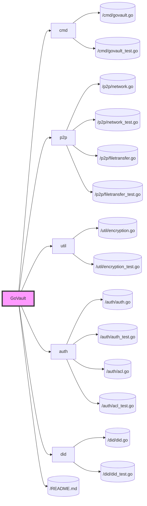

# Phase 2: Security and Identity

## Objective
Strengthen GoVault by integrating advanced security features, including user authentication, authorization, and encryption, as well as introducing a decentralized identity (DID) system for user management.

## Key Features
- Advanced encryption for file transfers and storage.
- User authentication and authorization.
- Integration of a decentralized identity (DID) system.

## Development Tasks

### 1. Advanced Encryption
- Implement end-to-end encryption for file transfers to ensure data privacy and security.
- Secure the storage of files and sensitive information on the user's device.

### 2. User Authentication and Authorization
- Develop the authentication mechanism using public/private key pairs.
- Create an authorization system to manage user permissions for file access, utilizing Access Control Lists (ACLs).

### 3. Decentralized Identity (DID) System
- Integrate a DID framework to manage user identities securely and without central authority.
- Enable users to register and authenticate using their DIDs.

### 4. Testing and Documentation
- Expand testing to cover new security features and the DID system.
- Update documentation to include setup and usage instructions for new features.

## File Structure with Phase 2 Development

## Expected Outcomes
- Enhanced security within GoVault through advanced encryption techniques and a robust authentication/authorization framework.
- A functional DID system for decentralized user identity management.
- Comprehensive testing and documentation reflecting the additions and changes made in this phase.
