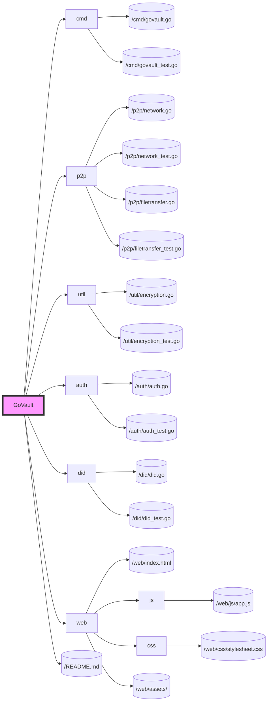

# Phase 3: User Interface and Experience

## Objective
Develop a web-based graphical user interface (GUI) for GoVault, enabling users to interact with the application via a web browser for a more intuitive and accessible file sharing experience.

## Key Features
- Web-based GUI for file operations (search, upload, download).
- Integration of the GUI with the backend services for seamless user interaction.
- Responsive design to ensure accessibility across various devices (desktops, tablets, smartphones).

## Development Tasks

### 1. Web-Based GUI Development
- Design and implement the front-end using HTML, CSS, and JavaScript.
- Utilize frameworks/libraries like React, Vue, or Angular for efficient development of the GUI.

### 2. Backend Integration
- Develop RESTful APIs or use WebSockets for real-time communication between the web frontend and the Go backend.
- Ensure secure authentication and authorization for accessing and managing files through the web interface.

### 3. Responsive Design
- Implement a responsive design to ensure the GUI is accessible and usable across different devices and screen sizes.

### 4. Testing and Documentation
- Conduct usability testing to ensure the GUI is intuitive and meets user needs.
- Document the setup and usage instructions for the web-based GUI.

## File Structure with Phase 3 Development

## Expected Outcomes
- A functional, web-based GUI that provides an intuitive interface for file sharing operations.
- Seamless integration between the web frontend and the Go backend, ensuring a smooth user experience.
- Comprehensive testing and documentation to support the deployment and use of the web-based GUI.
