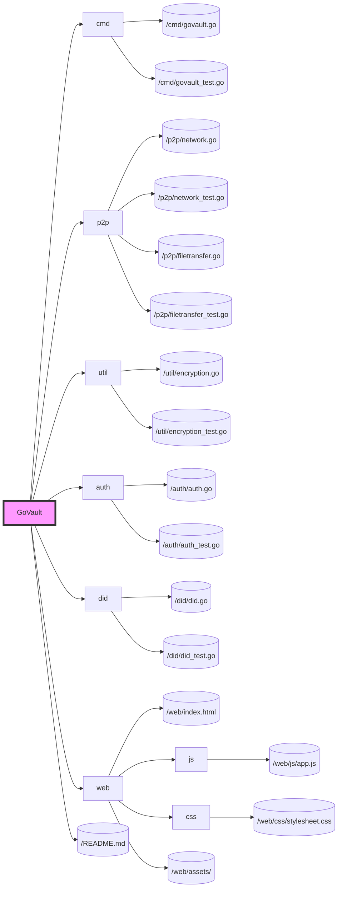

# Phase 4: Testing and Optimization

## Objective
Conduct extensive testing across the GoVault application to identify and resolve bugs, optimize performance, and ensure scalability. Prepare the application for a wider release by validating its readiness and stability.

## Key Features
- Comprehensive testing, including unit, integration, performance, and security testing.
- Performance optimization to enhance speed and efficiency.
- Scalability enhancements to ensure GoVault can handle increased load.

## Development Tasks

### 1. Comprehensive Testing
- **Unit Testing**: Ensure that all new and existing units of code are tested for correctness.
- **Integration Testing**: Test the integration points between the application's components, especially the web interface and the backend logic.
- **Performance Testing**: Benchmark the application to identify bottlenecks and optimize for speed and efficiency.
- **Security Testing**: Conduct security assessments to identify vulnerabilities and reinforce the application's defenses.

### 2. Performance Optimization
- Analyze performance testing results to identify and address bottlenecks in the application's backend and frontend.
- Optimize data storage and retrieval processes, especially in the context of P2P file sharing and the decentralized identity system.

### 3. Scalability Enhancements
- Implement or refine load balancing techniques to distribute traffic evenly across the network.
- Ensure the P2P network is robust and can scale to accommodate a growing number of users and files.

### 4. Documentation Update and Finalization
- Update the README.md and any other documentation to reflect the final state of the application and provide clear setup and usage instructions.
- Document best practices for scalability and performance optimization based on findings from this phase.

## File Structure with Phase 4 Development

No new directories or files are specifically added in this phase to the project structure. However, updates, optimizations, and enhancements will be made across existing files based on the outcomes of the testing and optimization processes.

## Expected Outcomes
- A thoroughly tested and optimized version of GoVault, ready for wider release.
- Improved performance and scalability, ensuring a seamless user experience even under increased load.
- Comprehensive documentation that guides users and developers on how to deploy, use, and contribute to GoVault.
