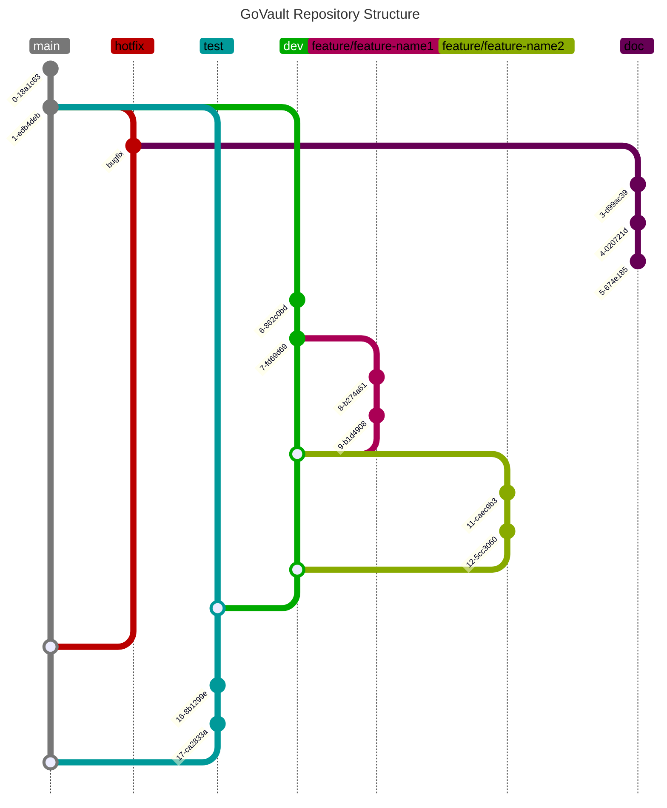

# GitHub Usage and GitFlow Methodology

This section provides a comprehensive overview of integrating GitFlow into the GoVault development process, including the roles of different branches and the workflow for moving changes through stages of development, testing, and release. The GitFlow model is instrumental in managing complex projects, ensuring stability, and facilitating continuous development and delivery.

## Objective
Implement the GitFlow branching strategy to organize the development process, facilitate continuous integration, and ensure a stable release cycle for GoVault.

## GitFlow Workflow

### Main Branches
- **main Branch**: Serves as the official release history. It contains the production-ready state of the project.
- **dev Branch**: Serves as the integration branch for features. It contains the pre-production state and all completed features for the next release.

### Supporting Branches
- **Feature Branches**: Branch off from `dev` and merge back into `dev` once the feature is complete. Each feature branch is dedicated to the development of a specific feature or improvement.
- **Release Branches**: Branch off from `dev` and merge into `main` and back into `develop` once the release is complete. Used for preparations of a new production release.
- **Hotfix Branches**: Branch off from `main` and merge back into `main` and `develop` once the fix is complete. Used to quickly patch production releases.

### Workflow Description
1. **Feature Development**: Start by creating a feature branch from `dev` for each new feature or significant improvement. Once the feature is completed, it is merged back into the `dev` branch.
2. **Release Preparation**: When `dev` has acquired enough features for a release, a release branch is created to finalize the new version. After testing and final adjustments, the release branch is merged into `main` for the official release and back into `dev` to incorporate any changes made during the release process.
3. **Hotfixes**: If an issue is discovered in the `main` branch, a hotfix branch is created to fix the issue. After the fix is tested, it's merged back into both `main` and `dev` to ensure that the fix is incorporated into the next release and the current development work.

## Branch Naming Conventions
- Feature branches: `feature/<feature-name>`
- Release branches: `test/<version>`
- Hotfix branches: `hotfix/<hotfix-description>`

## Mermaid Diagram for GitFlow Structure

## Expected Outcomes
- A well-organized codebase with clear distinctions between stable, development, and feature-specific work.
- Streamlined development processes allowing for efficient feature integration, testing, and release preparation.
- Enhanced ability to quickly address and deploy fixes to production issues.